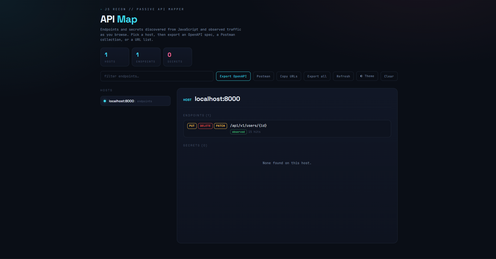

# JS Recon

<p align="center">
  
</p>

<p align="center">
  <strong>Passive JavaScript recon and API mapper for the browser.</strong><br>
  As you browse, mine every JavaScript bundle for secrets and endpoints, record the
  API calls a page actually makes, and build a live API map you can export as an
  OpenAPI spec, a Postman collection, or a URL list.
</p>

<p align="center">
  <a href="https://github.com/isukasanuj/JsRecon/releases/latest"></a>
  
  
  
  <a href="LICENSE"></a>
</p>



> [!CAUTION]
> JS Recon reads page JavaScript, fetches script files, and records request metadata to
> map an application's surface. Use it only on applications you own or are explicitly
> authorized to test. You use JS Recon at your own risk.

## Overview

JS Recon is an open-source, single-purpose Chromium extension for client-side
reconnaissance. It runs quietly in the background while you browse and turns scattered
JavaScript and live traffic into a structured, exportable API map.

It uses a content script plus the `webRequest` API rather than the debugger, so there is
no "started debugging this browser" banner, no proxy to configure, and no certificate to
install. It is the client-side recon component of a full testing workflow, packaged as its
own lightweight tool.

## Features

- Native Manifest V3 extension with a compact popup and a focused map view.
- Mine inline **and** external JavaScript for secrets and endpoints as you browse.
- Detect secrets: AWS, Google, GitHub, Slack, and Stripe keys, private keys, JWTs, and
  generic `apikey` / `secret` / `token` assignments.
- Record real `XHR`, `fetch`, `ping`, and `websocket` calls (method, path, query params)
  with no debugger banner.
- Merge everything into a per-host **API map** with templated paths
  (`/users/123` → `/users/{id}`) and observed-vs-from-JS source tags.
- Filter out known trackers and static assets to keep the map clean.
- Export a guessed **OpenAPI 3.0** spec, a **Postman v2.1** collection, a deduped **URL
  list** to the clipboard, or the full raw dataset as JSON.
- Scope collection to specific hosts (comma-separated, `*` wildcard).
- Light / dark theme toggle that persists across the popup and map view.

### Planned

- CSV export of the endpoint table.
- Merge multiple hosts into a single Postman collection.
- Optional response-shape inference for richer OpenAPI schemas.

## Requirements

| Requirement | Details |
|---|---|
| Browser | Chrome, Edge, Brave, or another Chromium browser with Manifest V3 |
| Mode | Developer mode enabled to load an unpacked extension |
| Network | Online for the first load so web fonts cache (falls back to system fonts offline) |
| Permissions | `storage`, `webRequest`, `tabs`, `activeTab`, and host access for the sites you map |

## Download And Install

### Option A: Load unpacked (recommended)

1. Download the latest ZIP from
   [GitHub Releases](https://github.com/isukasanuj/JsRecon/releases/latest) and unzip
   it to a permanent folder.
2. Open `chrome://extensions` (or `edge://extensions`).
3. Enable **Developer mode** with the toggle in the top-right.
4. Click **Load unpacked** and select the unzipped `js-recon` folder.
5. Pin the extension, open the popup, and confirm **Collecting** is on.

### Option B: Build a package

```bash
git clone https://github.com/isukasanuj/JsRecon.git
cd js-recon
zip -r js-recon.zip . -x ".*"
```

Load the unzipped folder as in Option A, or distribute the ZIP for others to load.

## Map An Application

1. Open the popup and make sure **Collecting** is on.
2. Optionally set a **scope** so only the hosts you care about are recorded.
3. Browse the target application normally — log in, click through, exercise features.
   The badge shows a live endpoint count.
4. Click **Open API map**.
5. Pick a host on the left to see its endpoints, parameters, source tags, and any secrets.
6. Export with **OpenAPI**, **Postman**, **Copy URLs**, or **Export all**.

## What It Collects

| Source | Captured |
|---|---|
| **Endpoints from JS** | Paths and absolute URLs found in inline and external scripts |
| **Observed endpoints** | Real `XHR` / `fetch` / `ping` / `websocket` calls (method, path, query params) |
| **Secrets** | AWS / Google / GitHub / Slack / Stripe keys, private keys, JWTs, generic secret assignments |
| **Per-host map** | Endpoints merged by host with templated IDs and `observed` / `from JS` tags |

## Exports

| Export | Output |
|---|---|
| **OpenAPI** | A guessed OpenAPI 3.0 spec for the selected host (paths, methods, path and query parameters) |
| **Postman** | A Postman v2.1 collection with `:id` path variables and query keys, one request per method |
| **Copy URLs** | A deduped, sorted list of full endpoint URLs copied to the clipboard |
| **Export all** | The complete raw dataset as JSON |

## Settings

| Setting | Behavior |
|---|---|
| **Collecting** | Master switch for passive mining and traffic recording |
| **Scope** | Comma-separated host patterns (`*` wildcard); blank collects everything in scope |
| **Theme** | Toggle light / dark; persists across the popup and map view |

> [!WARNING]
> Detected secrets are pattern matches and may be false positives or expired test values.
> Verify before acting on them, and never paste real secrets into bug reports.

## How JS Recon Stays Clean And Quiet

- Uses a content script and `webRequest` instead of the debugger, so there is no debugging
  banner and no interference with normal browsing.
- Filters known trackers and static assets out of the API map.
- Templates volatile path IDs so the same endpoint is not listed hundreds of times.
- Scans storage **keys** and cookies for token patterns locally; it does not exfiltrate
  storage values.
- Fails silently when an external script cannot be fetched (CORS or auth) instead of erroring.
- Honors the configured scope so out-of-scope hosts are never recorded.

JS Recon maps an application's surface; it does not attack anything. Pair it with a proxy
or fuzzer for active testing.

## Troubleshooting

### JS Recon found nothing

- Confirm **Collecting** is on in the popup.
- Check the **scope** — if it is set, only matching hosts are recorded.
- Browse the target first; the map fills in as scripts load and requests fire.
- Some external scripts cannot be fetched due to CORS or authentication and are skipped.

### The map looks noisy

Set a scope to the target host(s). Trackers and assets are already filtered, but a tight
scope keeps third-party endpoints out entirely.

### Secrets look like false positives

The scanner is pattern-based. Treat findings as leads, confirm them manually, and expect
some noise from test or expired values.

### Fonts look plain

Space Grotesk and JetBrains Mono load from Google Fonts on first run and then cache. Offline,
the interface falls back to your system sans-serif and monospace fonts.

### Copy URLs did nothing

If clipboard access is blocked, JS Recon downloads the URL list as a `.txt` file instead.

## Build From Source

JS Recon is plain JavaScript with no build step. To package a distributable ZIP:

```bash
git clone https://github.com/isukasanuj/JsRecon.git
cd js-recon
zip -r js-recon.zip . -x ".*"
```

Then load the folder as an unpacked extension, or share the ZIP.

## Project Structure

```text
js-recon/
├── manifest.json     Manifest V3 definition and permissions
├── background.js     Engine: webRequest observation, JS mining, the API-map model
├── cs.js             Content script that reads page scripts and storage keys
├── theme.js          Shared light / dark theme applier
├── popup.html/.js    Collecting toggle, scope, live stats
├── viewer.html/.js   API map, endpoint and secret views, exporters
└── icons/            Extension icons
```

## Technical Notes

JS Recon does not run a proxy. It observes request metadata through `webRequest` and reads
page JavaScript through a content script, then mines and merges the results.

The recon pipeline is:

```text
content script reads inline scripts + script URLs + storage keys
  -> background fetches external scripts
  -> mine all sources for secrets and endpoints
  -> webRequest records observed XHR/fetch/ping/websocket calls
  -> template path IDs and filter trackers/assets
  -> merge into a per-host API map
  -> export OpenAPI / Postman / URL list / JSON
```

## Contributing

Issues and pull requests are welcome. When reporting a problem, include:

- Browser and version.
- What you expected to be discovered versus what appeared.
- Whether **Collecting** was on and what scope was set.

Do not paste real secrets, internal hostnames, or proprietary data into issues.

## License And Credits

JS Recon is available under the [MIT License](LICENSE).

JS Recon is built on standard browser extension APIs and bundles no third-party runtime
code. It is not affiliated with any vendor whose keys or endpoints it may detect.
